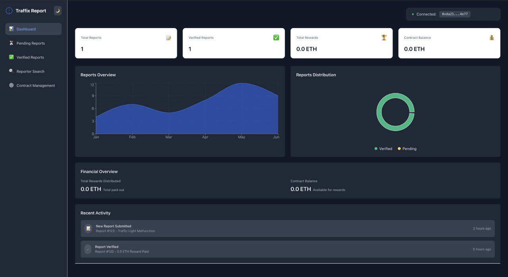

# Traffix Dashboard 🚦

A decentralized traffic reporting system dashboard that allows administrators to manage and verify traffic-related reports submitted by users.



## 🌟 Features

### Authentication & Security
- MetaMask wallet integration for secure authentication
- Contract owner verification
- Secure wallet connection and disconnection

### Dashboard Overview
- Real-time statistics display
  - Total reports submitted
  - Number of verified reports
  - Total rewards distributed
  - Current contract balance
- Interactive charts and visualizations
  - Reports distribution (Verified vs Pending)
  - Monthly reporting trends
- Recent activity feed

### Report Management
- View pending reports awaiting verification
- Access verified report history
- Search reports by reporter's wallet address
- Verify and process user-submitted reports

### User Interface
- Clean, modern interface with intuitive navigation
- Dark/Light mode support
- Responsive design for all screen sizes
- Real-time updates and notifications

## 🛠 Technology Stack

- **Frontend Framework**: React.js
- **Styling**: Tailwind CSS
- **Blockchain Integration**: Ethers.js
- **Charts**: Recharts
- **State Management**: React Context API
- **Wallet Integration**: MetaMask

## 🚀 Getting Started

1. **Prerequisites**
   ```bash
   - Node.js (v14 or higher)
   - MetaMask browser extension
   - Access to Ethereum network (testnet or mainnet)
   ```

2. **Installation**
   ```bash
   # Clone the repository
   git clone https://github.com/yourusername/traffix-dashboard.git

   # Navigate to project directory
   cd traffix-dashboard

   # Install dependencies
   npm install
   ```

3. **Configuration**
   ```javascript
   // Create .env file in root directory
   REACT_APP_CONTRACT_ADDRESS=your_contract_address
   REACT_APP_NETWORK_ID=your_network_id
   ```

4. **Running the Application**
   ```bash
   # Start development server
   npm start

   # Build for production
   npm run build
   ```

## 🔒 Security

- Only the contract owner can access the dashboard
- Secure wallet connection handling
- Protected routes and authenticated API calls
- Input validation and sanitization

## 🤝 Contributing

1. Fork the repository
2. Create your feature branch (`git checkout -b feature/AmazingFeature`)
3. Commit your changes (`git commit -m 'Add some AmazingFeature'`)
4. Push to the branch (`git push origin feature/AmazingFeature`)
5. Open a Pull Request

## 📜 License

This project is licensed under the MIT License - see the [LICENSE.md](LICENSE.md) file for details.

## 👥 Contact

Your Name - [@yourtwitter](https://twitter.com/yourtwitter)
Project Link: [https://github.com/yourusername/traffix-dashboard](https://github.com/yourusername/traffix-dashboard)

## 🙏 Acknowledgments

- [Ethereum](https://ethereum.org/)
- [MetaMask](https://metamask.io/)
- [React](https://reactjs.org/)
- [Tailwind CSS](https://tailwindcss.com/)
- [Recharts](https://recharts.org/)

---

<p align="center">
  Made with ❤️ Parthav</p>
